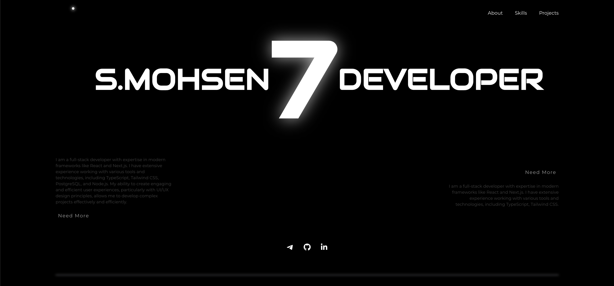

# 🚀 Seyed Mohsen Mousavi | Full-Stack Developer

🎉 **Welcome to my portfolio!** This is where I showcase my skills, experience, and projects as a **Full-Stack Developer** specializing in modern web technologies.

🔗 **Live Demo:** (https://xseyed.vercel.app/)

---

## 📸 Preview

---

## 🛠 Technologies & Skills
- ⚡ **Frontend:**  Next.js, TypeScript, Tailwind CSS
- 🎨 **UI/UX:** Responsive Design, Web Performance Optimization
- 🔍 **SEO & Accessibility:** Search Engine Optimization, Best Practices
- 🚀 **Deployment:** Vercel, CI/CD

---

## ⭐ Support the Project
If you like this project, please **give it a star (⭐) on GitHub** and share it with others! 🚀

🔗 [GitHub Repository](https://github.com/seyed-mohsen-mousavi/ME)

---

## 📞 Contact Me
📧 **Email:** [1mr.rooter@example.com](1mr.rooter3@gmail.com)  
🐦 **Twitter:** [@nimchePower](https://x.com/nimchePower)  
💼 **LinkedIn:** [xseyed](https://www.linkedin.com/in/xseyed)  

---

🚀 Built with **Next.js** & **Tailwind CSS** | Hosted on **Vercel**
